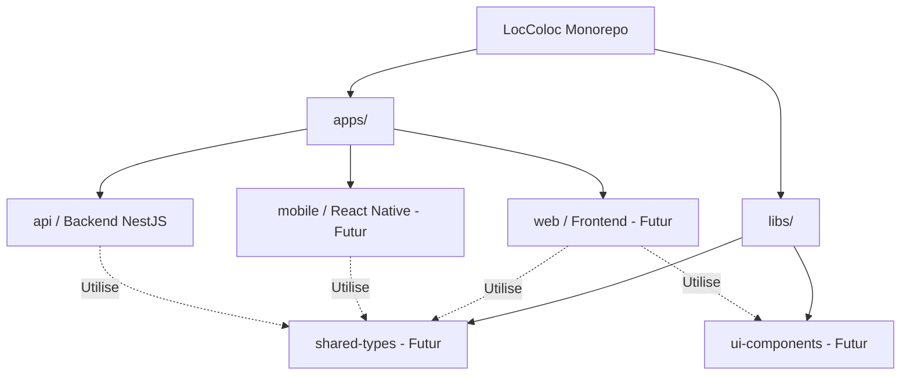
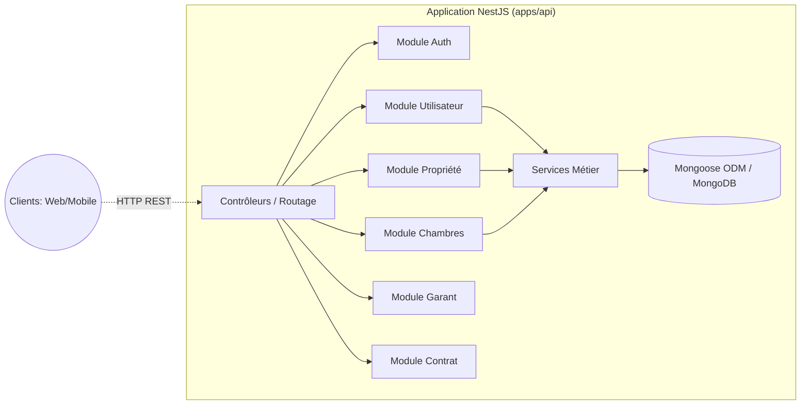

# 🏗️ Architecture du Système LocColoc

Ce document décrit l'architecture globale du système LocColoc.

## 📦 Structure du Workspace Monorepo

LocColoc utilise une configuration monorepo gérée via des espaces de travail standards de gestionnaire de paquets (workspaces).

## 🔌 Architecture de l'API (Backend)

Le backend (`apps/api`) est construit sur **NestJS** et suit une architecture modulaire et orientée domaine, exposant des points d'accès RESTful.

## ⚙️ Comportements Principaux du Système

1. **Authentification & Autorisation** : Gérées centralement via le module Auth. Les utilisateurs doivent être authentifiés pour interagir avec les ressources.
2. **Système d'Attachement de Chambre** : Une fonctionnalité unique où une `Room` (Chambre) est exclusivement attachée à une seule `Property` (Propriété). Une fois attachée, elle ne peut pas être réutilisée avant d'être détachée.
3. **Flux basés sur les Rôles** : Des flux de travail distincts existent selon que l'utilisateur authentifié est un `Propriétaire` (Owner), un `Locataire` (Tenant) ou un `Admin`.
