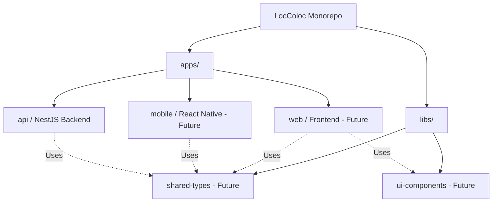
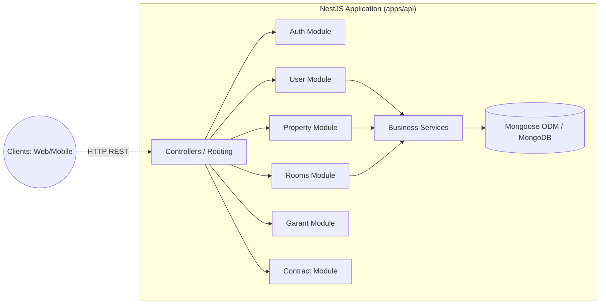

# 🏗️ LocColoc System Architecture
This document describes the high-level architecture of the LocColoc system.

## 📦 Monorepo Workspace Structure

LocColoc uses a monorepo setup managed via standard package manager workspaces. 

## 🔌 API Architecture (Backend)

The backend (`apps/api`) is built on **NestJS** and follows a modular, resource-driven domain architecture, exposing RESTful endpoints.

## ⚙️ Core System Behaviors

1. **Authentication & Authorization**: Handled centrally via the Auth module. Users must be authenticated to interact with resources.
2. **Room Attachment System**: A unique feature where a `Room` is uniquely attached to a single `Property`. Once attached, it cannot be reused until detached.
3. **Role-Based Workflows**: Distinct workflows exist depending on whether the authenticated User is an `Owner`, `Tenant` (Locataire), or `Admin`.
