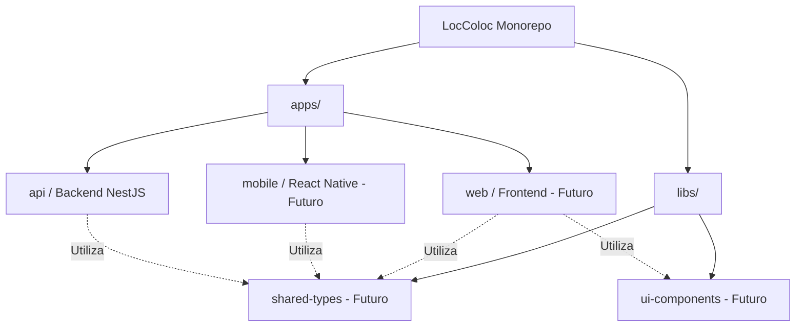
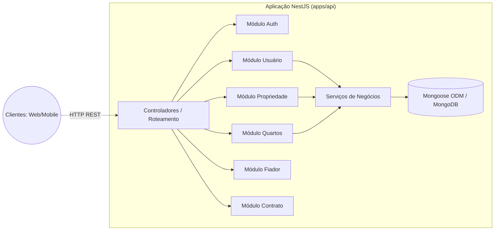

# 🏗️ Arquitetura do Sistema LocColoc

Este documento descreve a arquitetura de alto nível do sistema LocColoc.

## 📦 Estrutura do Workspace Monorepo

O LocColoc usa uma configuração monorepo gerenciada através de espaços de trabalho (workspaces) padrão do gerenciador de pacotes.

## 🔌 Arquitetura da API (Backend)

O backend (`apps/api`) é construído em **NestJS** e segue uma arquitetura modular orientada ao domínio, expondo endpoints RESTful.

## ⚙️ Comportamentos Principais do Sistema

1. **Autenticação & Autorização**: Gerenciadas centralmente via módulo Auth. Os usuários devem estar autenticados para interagir com os recursos.
2. **Sistema de Anexação de Quartos**: Um recurso único onde um `Room` (Quarto) é fixado exclusivamente a apenas uma `Property` (Propriedade). Uma vez associado, não pode ser reutilizado até ser desvinculado.
3. **Fluxos baseados em Funções (Role-Based)**: Existem fluxos de trabalho distintos dependendo se o usuário autenticado é um `Proprietário` (Owner), `Locatário` (Tenant) ou `Admin`.
