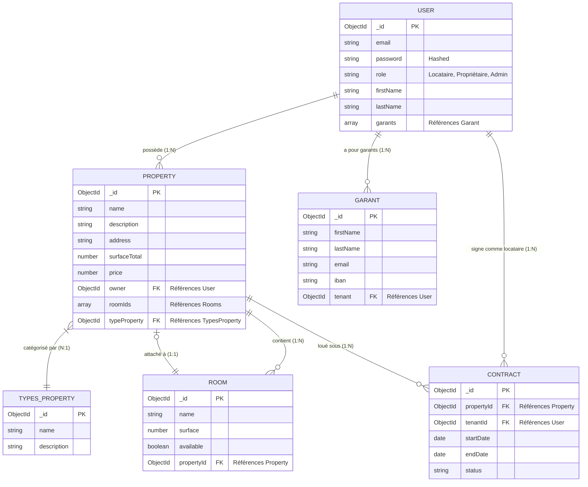

# 🗄️ Diagramme Entité-Relation (ERD)

Ce diagramme visualise le modèle de données MongoDB pour LocColoc basé sur les schémas NestJS Mongoose.

## Détails des Relations
- **Utilisateur (Propriétaire) ↔ Propriété** : Un Propriétaire peut posséder plusieurs Propriétés.
- **Propriété ↔ Chambres** : Une Propriété contient plusieurs Chambres. Cependant, une Chambre est exclusivement liée à UNE Propriété ou reste flottante/disponible.
- **Utilisateur (Locataire) ↔ Garant** : Un Locataire peut déclarer plusieurs garants.
- **Propriété ↔ Type de Propriété** : Une Propriété est classée sous une seule catégorie (ex: Appartement, Studio, Maison).
