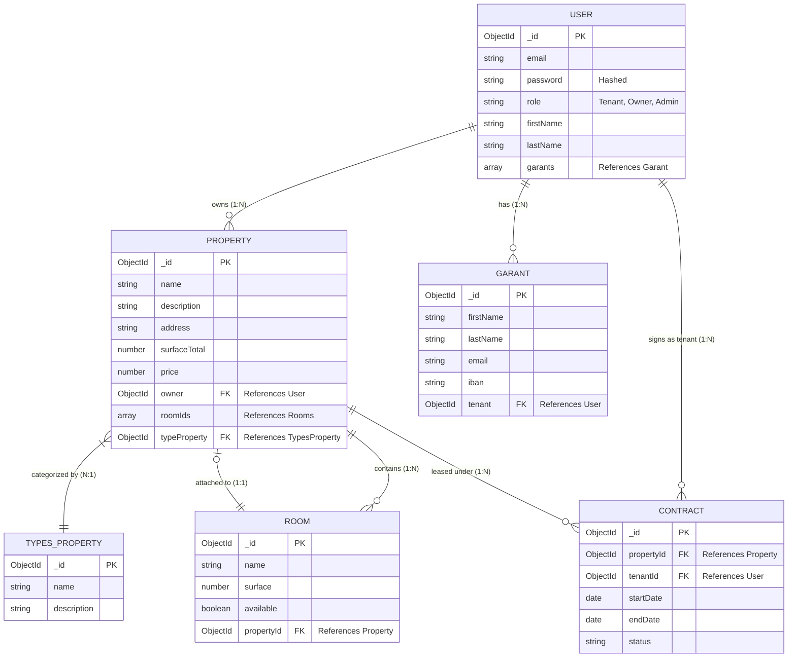

# 🗄️ Entity-Relationship Diagram (ERD)
This diagram visualizes the MongoDB data model for LocColoc based on the NestJS Mongoose schemas.

## Relationship Details
- **User (Owner) ↔ Property**: One Owner can have multiple Properties.
- **Property ↔ Rooms**: A Property contains multiple Rooms. However, a Room is exclusively tied to ONE Property at a given time or is floating/available.
- **User (Tenant) ↔ Garant**: A Tenant can register multiple guarantors (Garants).
- **Property ↔ TypesProperty**: A Property is classified under one category (e.g., Apartment, Studio, House).
