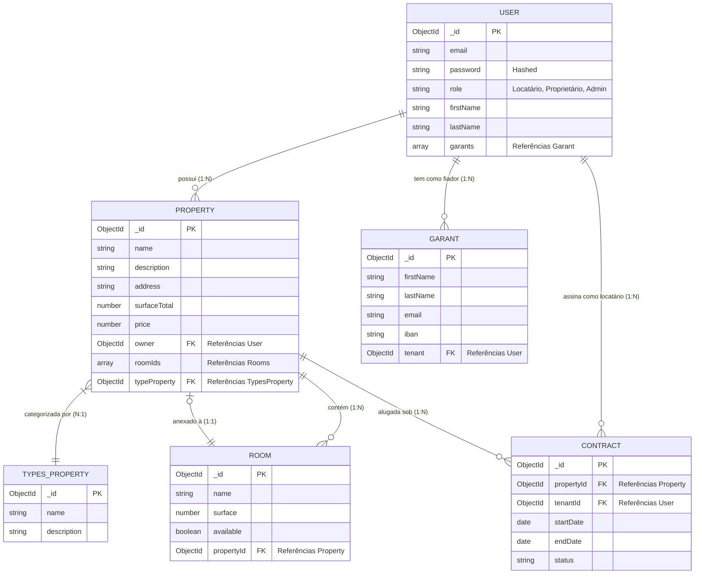

# 🗄️ Diagrama Entidade-Relacionamento (ERD)

Este diagrama visa expor o modelo de dados MongoDB para a LocColoc com base nos esquemas do NestJS Mongoose.

## Detalhes dos Relacionamentos
- **Usuário (Proprietário) ↔ Propriedade**: Um Proprietário pode ter múltiplas Propriedades.
- **Propriedade ↔ Quartos**: Uma Propriedade contém múltiplos Quartos. Contudo, um Quarto é exclusivamente vinculado a UMA Propriedade a qualquer momento ou fica disponível/solto.
- **Usuário (Locatário) ↔ Fiador**: Um Locatário pode registrar inúmeros fiadores (Garants).
- **Propriedade ↔ Tipo de Propriedade**: Uma Propriedade é classificada sob uma categoria primária (ex: Apartamento, Estúdio, Casa).
