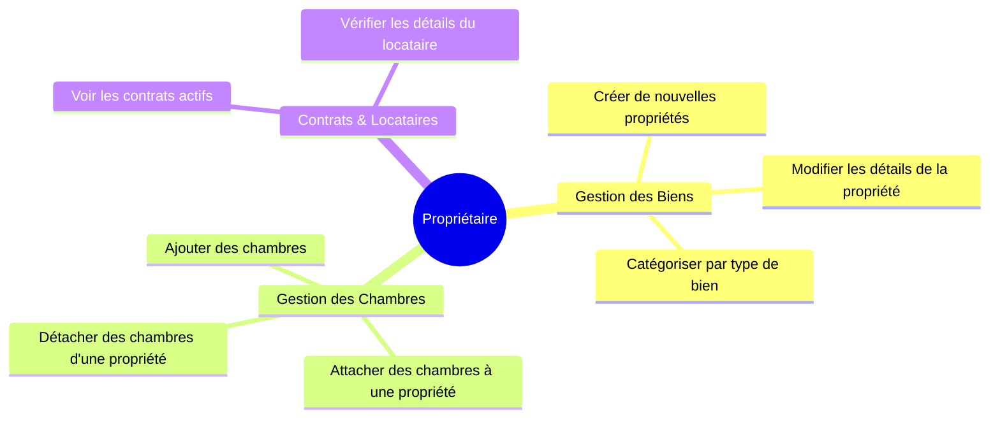

# 👥 Cas d'Utilisation du Système

Ci-dessous se trouvent les diagrammes des principaux cas d'utilisation pour l'application LocColoc, divisés par rôles d'utilisateurs : **Locataire (Tenant)**, **Propriétaire (Owner)**, et **Administrateur**.

## 🏠 Cas d'Utilisation du Propriétaire

Le propriétaire de biens est principalement responsable de la gestion des propriétés, de leurs chambres sous-jacentes et des contrats associés.



_Alternativement, représenté comme un Diagramme de Cas d'Utilisation standard :_

```mermaid
usecaseDiagram
    actor Propriétaire
    
    usecase "Créer une Propriété" as UC1
    usecase "Attacher Chambre à la Propriété" as UC2
    usecase "Détacher Chambre" as UC3
    usecase "Lister ses Propriétés" as UC4
    
    Propriétaire --> UC1
    Propriétaire --> UC2
    Propriétaire --> UC3
    Propriétaire --> UC4
```

---

## 🔑 Cas d'Utilisation du Locataire

Le locataire recherche des propriétés et fournit les détails de ses garanties financières.

```mermaid
usecaseDiagram
    actor Locataire
    
    usecase "Parcourir les Chambres Disponibles" as UC11
    usecase "Enregistrer un Garant" as UC12
    usecase "Voir ses Contrats" as UC13
    usecase "Mettre à jour le Profil" as UC14
    
    Locataire --> UC11
    Locataire --> UC12
    Locataire --> UC13
    Locataire --> UC14
```

---

## 🛡️ Cas d'Utilisation de l'Administrateur

L'administrateur a un contrôle global sur les entités du système, y compris la gestion des types de propriétés et l'audit des modifications.

```mermaid
usecaseDiagram
    actor Admin
    
    usecase "Gérer les Utilisateurs" as UC21
    usecase "Gérer les Types de Biens" as UC22
    usecase "Voir les Audits/Logs" as UC23
    usecase "Configuration du Système" as UC24
    
    Admin --> UC21
    Admin --> UC22
    Admin --> UC23
    Admin --> UC24
```
