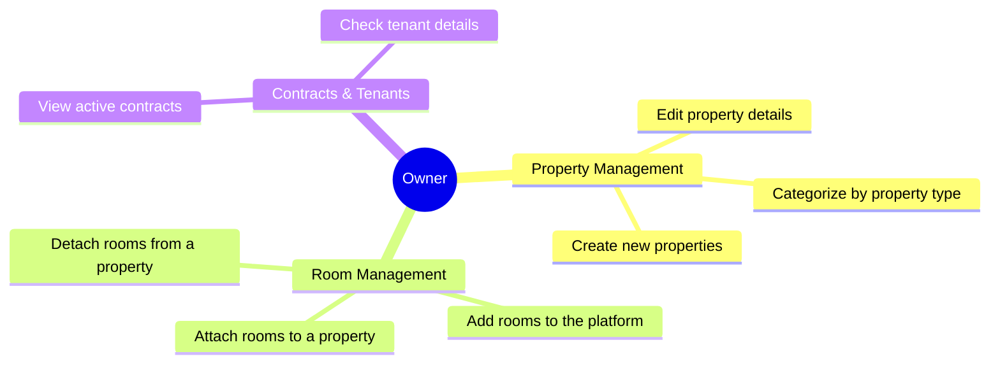

# 👥 System Use Cases
Below are the key use case diagrams for the LocColoc application, split by user roles: **Tenant (Locataire)**, **Owner (Propriétaire)**, and **Administrator**.

## 🏠 Owner (Propriétaire) Use Cases

The property owner is primarily responsible for managing properties, their underlying rooms, and the associated contracts.



_Alternatively, represented as a standard Use Case Diagram:_

```mermaid
usecaseDiagram
    actor Owner
    
    usecase "Create Property" as UC1
    usecase "Attach Room to Property" as UC2
    usecase "Detach Room" as UC3
    usecase "List Owned Properties" as UC4
    
    Owner --> UC1
    Owner --> UC2
    Owner --> UC3
    Owner --> UC4
```

---

## 🔑 Tenant (Locataire) Use Cases

The tenant looks for properties and provides financial guarantee details.

```mermaid
usecaseDiagram
    actor Tenant
    
    usecase "Browse Available Rooms" as UC11
    usecase "Register Guarantor (Garant)" as UC12
    usecase "View Own Contracts" as UC13
    usecase "Update Profile" as UC14
    
    Tenant --> UC11
    Tenant --> UC12
    Tenant --> UC13
    Tenant --> UC14
```

---

## 🛡️ Administrator Use Cases

The admin has holistic control over the system entities, including managing property types and auditing changes.

```mermaid
usecaseDiagram
    actor Admin
    
    usecase "Manage Users (All Roles)" as UC21
    usecase "Manage Property Types" as UC22
    usecase "View Audits/Logs" as UC23
    usecase "System Configuration" as UC24
    
    Admin --> UC21
    Admin --> UC22
    Admin --> UC23
    Admin --> UC24
```
