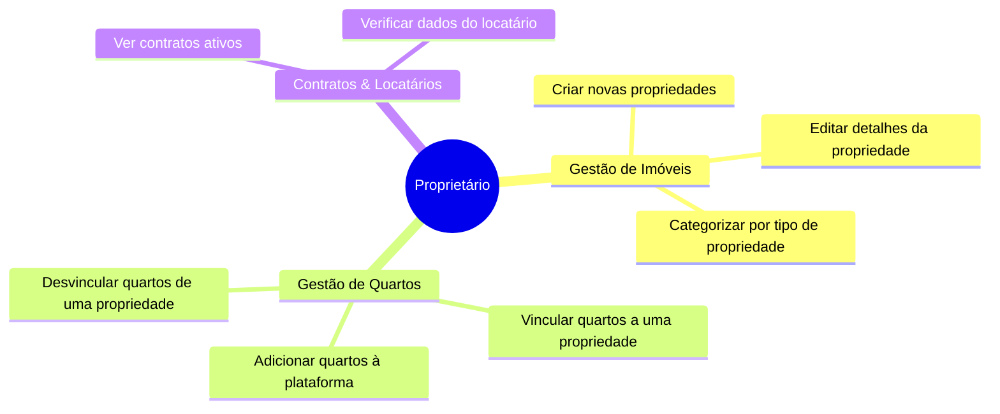

# 👥 Casos de Uso do Sistema

Abaixo estão os diagramas com os principais casos de uso para o aplicativo LocColoc, separados por papéis de usuário: **Locatário (Tenant)**, **Proprietário (Owner)** e **Administrador**.

## 🏠 Casos de Uso do Proprietário

O proprietário do imóvel é responsável principalmente por gerenciar suas propriedades, os respectivos quartos e os contratos associados.



_Alternativamente, representado como um Diagrama de Caso de Uso padrão:_

```mermaid
usecaseDiagram
    actor Proprietario
    
    usecase "Criar Propriedade" as UC1
    usecase "Vincular Quarto à Propriedade" as UC2
    usecase "Desvincular Quarto" as UC3
    usecase "Listar Propriedades" as UC4
    
    Proprietario --> UC1
    Proprietario --> UC2
    Proprietario --> UC3
    Proprietario --> UC4
```

---

## 🔑 Casos de Uso do Locatário

O locatário procura imóveis e fornece detalhes de garantias financeiras.

```mermaid
usecaseDiagram
    actor Locatario
    
    usecase "Pesquisar Quartos Disponíveis" as UC11
    usecase "Registrar Fiador" as UC12
    usecase "Ver Meus Contratos" as UC13
    usecase "Atualizar Perfil" as UC14
    
    Locatario --> UC11
    Locatario --> UC12
    Locatario --> UC13
    Locatario --> UC14
```

---

## 🛡️ Casos de Uso do Administrador

O administrador tem controle total sobre as entidades do sistema, incluindo o gerenciamento de tipos de propriedade e auditoria das modificações.

```mermaid
usecaseDiagram
    actor Admin
    
    usecase "Gerenciar Usuários" as UC21
    usecase "Gerenciar Tipos de Imóveis" as UC22
    usecase "Acessar Auditorias/Logs" as UC23
    usecase "Configuração do Sistema" as UC24
    
    Admin --> UC21
    Admin --> UC22
    Admin --> UC23
    Admin --> UC24
```
